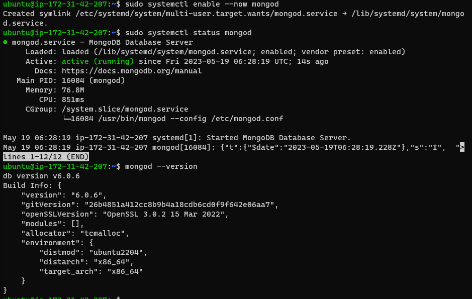
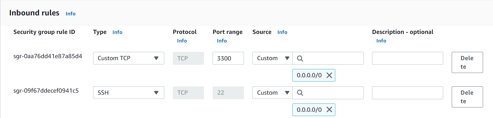
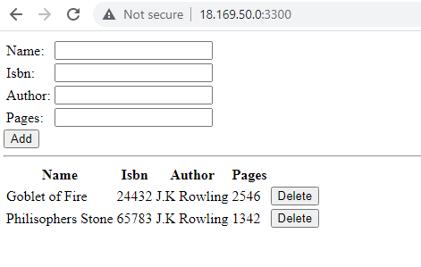

# MEAN STACK DEPLOYMENT TO UBUNTU ON AWS

MEAN Stack is a combination of following components:
1. MongoDB (Document database) – Stores and allows to retrieve data.
2. Express (Back-end application framework) – Makes requests to Database for Reads and Writes.
3. Angular (Front-end application framework) – Handles Client and Server Requests
4. Node.js (JavaScript runtime environment) – Accepts requests and displays results to end user

## INSTALL NODEJS

Node.js is a JavaScript runtime built on Chrome’s V8 JavaScript engine. Node.js is used to set up the Express routes and AngularJS controllers.

I updated and upgraded ubuntu using the following commands

`sudo apt update`

`sudo apt upgrade`

Next I add the necessary certificates and dependencies for installing Node.js

`sudo apt -y install curl dirmngr apt-transport-https lsb-release ca-certificates`

Then, I installed Node.js using the NodeSource repository: 

`curl -sL https://deb.nodesource.com/setup_18.x | sudo -E bash -`

## INSTALL MONGODB

MongoDB is a NoSQL database used to store the application's data. We followed the steps below to install MongoDB:

We added the MongoDB GPG key and repository to our system

`curl -fsSL https://www.mongodb.org/static/pgp/server-6.0.asc|sudo gpg --dearmor -o /etc/apt/trusted.gpg.d/mongodb-6.gpg`

`echo "deb [ arch=amd64,arm64 ] https://repo.mongodb.org/apt/ubuntu $(lsb_release -cs)/mongodb-org/6.0 multiverse" | sudo tee /etc/apt/sources.list.d/mongodb-org-6.0.list`

I update apt - `sudo apt update`

and now I install mongodb using the command 

`sudo apt install -y mongodb-org`

After successful installation, start and enable MongoDB using the following commands: 

`sudo systemctl enable --now mongod`

check MongoDB status:

`sudo systemctl status mongod`

check MongoDB installed version:

`mongod --version`

The results can be seen in the picture below:



I install the npm-Node package manager:

`sudo apt install -y npm`

body-parser package is installed to help process JSON files passed in requests to the server:

`sudo npm install body-parser`

I create a books directory and initialize the npm project

`mkdir Books && cd Books`

Within the Books directory:

`npm init`

I added a file for the server:

`vi server.js`

The following code is written into it:
```
var express = require('express');
var bodyParser = require('body-parser');
var app = express();
app.use(express.static(__dirname + '/public'));
app.use(bodyParser.json());
require('./apps/routes')(app);
app.set('port', 3300);
app.listen(app.get('port'), function() {
    console.log('Server up: http://localhost:' + app.get('port'));
});

```

## INSTALL EXPRESS AND SET UP ROUTES TO THE SERVER

Express is a minimal and flexible Node.js web application framework that provides features for web and mobile applications. I will use Express in to pass book information to and from our MongoDB database.

I also will use Mongoose package which provides a straight-forward, schema-based solution to model your application data. I will use Mongoose to establish a schema for the database to store data of our book register.

`sudo npm install express mongoose`

In 'Books' folder, create a folder named apps:

`mkdir apps && cd apps`

create the routes.js file: 

`vi routes.js`

write the following code into it: 

```
const Book = require('./models/book');

module.exports = function(app){
  app.get('/book', function(req, res){
    Book.find({}).then(result => {
      res.json(result);
    }).catch(err => {
      console.error(err);
      res.status(500).send('An error occurred while retrieving books');
    });
  });

  app.post('/book', function(req, res){
    const book = new Book({
      name: req.body.name,
      isbn: req.body.isbn,
      author: req.body.author,
      pages: req.body.pages
    });
    book.save().then(result => {
      res.json({
        message: "Successfully added book",
        book: result
      });
    }).catch(err => {
      console.error(err);
      res.status(500).send('An error occurred while saving the book');
    });
  });

  app.delete("/book/:isbn", function(req, res){
    Book.findOneAndRemove(req.query).then(result => {
      res.json({
        message: "Successfully deleted the book",
        book: result
      });
    }).catch(err => {
      console.error(err);
      res.status(500).send('An error occurred while deleting the book');
    });
  });

  const path = require('path');
  app.get('*', function(req, res){
    res.sendFile(path.join(__dirname, 'public', 'index.html'));
  });
};


```

In the 'apps' folder, create a folder named models:
`mkdir models && cd models`

I create a file named book.js and paste the following code in it:

```
var mongoose = require('mongoose');
var dbHost = 'mongodb://localhost:27017/test';
mongoose.connect(dbHost);
mongoose.connection;
mongoose.set('debug', true);
var bookSchema = mongoose.Schema( {
  name: String,
  isbn: {type: String, index: true},
  author: String,
  pages: Number
});
var Book = mongoose.model('Book', bookSchema);
module.exports = mongoose.model('Book', bookSchema);
```

## ACCESS THE ROUTES WITH ANGULAR JS

AngularJS provides a web framework for creating dynamic views in your web applications. I use AngularJS to connect our web page with Express and perform actions on our book register.

Change the directory back to ‘Books’ and create a folder named public:
`mkdir public && cd public`

A file named in script.js is created and the following code is written it:

```
var app = angular.module('myApp', []);
app.controller('myCtrl', function($scope, $http) {
  $http( {
    method: 'GET',
    url: '/book'
  }).then(function successCallback(response) {
    $scope.books = response.data;
  }, function errorCallback(response) {
    console.log('Error: ' + response);
  });
  $scope.del_book = function(book) {
    $http( {
      method: 'DELETE',
      url: '/book/:isbn',
      params: {'isbn': book.isbn}
    }).then(function successCallback(response) {
      console.log(response);
    }, function errorCallback(response) {
      console.log('Error: ' + response);
    });
  };
  $scope.add_book = function() {
    var body = '{ "name": "' + $scope.Name + 
    '", "isbn": "' + $scope.Isbn +
    '", "author": "' + $scope.Author + 
    '", "pages": "' + $scope.Pages + '" }';
    $http({
      method: 'POST',
      url: '/book',
      data: body
    }).then(function successCallback(response) {
      console.log(response);
    }, function errorCallback(response) {
      console.log('Error: ' + response);
    });
  };
});
```
In public folder, I create a file called index.html and write the following code in it:

```
<!doctype html>
<html ng-app="myApp" ng-controller="myCtrl">
  <head>
    <script src="https://ajax.googleapis.com/ajax/libs/angularjs/1.6.4/angular.min.js"></script>
    <script src="script.js"></script>
  </head>
  <body>
    <div>
      <table>
        <tr>
          <td>Name:</td>
          <td><input type="text" ng-model="Name"></td>
        </tr>
        <tr>
          <td>Isbn:</td>
          <td><input type="text" ng-model="Isbn"></td>
        </tr>
        <tr>
          <td>Author:</td>
          <td><input type="text" ng-model="Author"></td>
        </tr>
        <tr>
          <td>Pages:</td>
          <td><input type="number" ng-model="Pages"></td>
        </tr>
      </table>
      <button ng-click="add_book()">Add</button>
    </div>
    <hr>
    <div>
      <table>
        <tr>
          <th>Name</th>
          <th>Isbn</th>
          <th>Author</th>
          <th>Pages</th>

        </tr>
        <tr ng-repeat="book in books">
          <td>{{book.name}}</td>
          <td>{{book.isbn}}</td>
          <td>{{book.author}}</td>
          <td>{{book.pages}}</td>

          <td><input type="button" value="Delete" data-ng-click="del_book(book)"></td>
        </tr>
      </table>
    </div>
  </body>
</html>
```

Everything is set and now I will start the server to ensure that everything is working fine. 

The server is started by running the following command: 
`node server.js`

Note: Open port 3300 in the aws inbound rules settings as shown in the image below. For security reasons, only allowed IP addresses should be allowed to ssh into your machine. 




We can see the web version of the app deployed in the image below:

